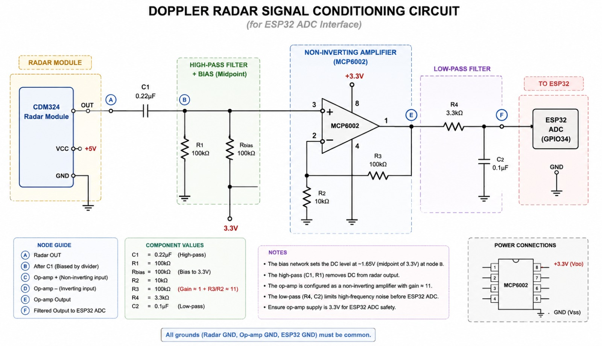
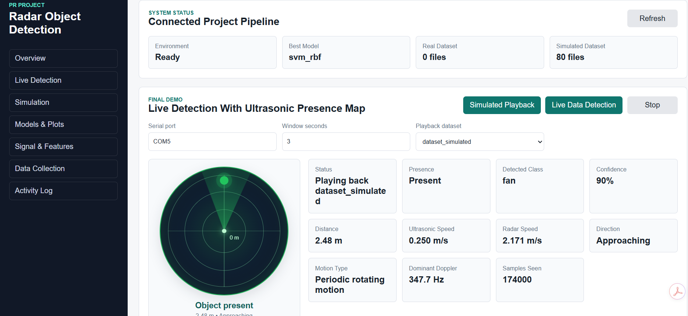

# Radar Object Detection And Classification System

Final project repository for a real-time object detection and classification system using a CDM324 Doppler radar front end, MCP6002 analog signal conditioning, ESP32 firmware, optional HC-SR04 ultrasonic live verification, SSD1306 OLED display, and machine learning.

The system collects radar Doppler data, extracts signal features, compares multiple ML models, selects the best supervised classifier, and supports both a Python/web development demo and modular ESP32 firmware.

## Project Preview

### Signal Conditioning Circuit



### Local Web Dashboard



## What The System Does

- Samples the conditioned CDM324 radar signal through ESP32 `GPIO34`.
- Logs labeled radar recordings for classes such as `human`, `fan`, `background`, and optional `pet` or `vehicle`.
- Applies DSP preprocessing, FFT, STFT, and spectral feature extraction.
- Compares supervised ML models and unsupervised clustering methods.
- Saves the best supervised model for live prediction.
- Provides a local web dashboard for simulation, training, plots, signal analysis, recording, and live detection.
- Provides modular ESP32 firmware for final embedded integration with OLED display.

## Important Scope Note

The radar-only signal can estimate motion presence, Doppler frequency, speed magnitude, and broad object/motion class. True radar range and true approach/recede direction are not available from the single-channel CDM324 Doppler signal alone.

In the final firmware, the ultrasonic sensor is used only for live presence, distance, speed, and direction support. The ML classifier must use radar-derived features only.

## Runtime Flow

```text
Radar sensor -> Signal conditioning -> ESP32 ADC -> DSP -> Feature extraction -> ML classification -> Dashboard/OLED output
```

Final embedded flow:

```text
CDM324 radar + HC-SR04 + ESP32 -> Radar feature extraction -> ML inference -> OLED display
```

Example final output:

```text
Object     : Human
Confidence : 97.4%
Distance   : 2.38 m
Speed      : 0.84 m/s
Motion     : Approaching
```

## Hardware

- CDM324 radar output through AC coupling, midpoint bias, MCP6002 amplification, and low-pass filtering to ESP32 `GPIO34`.
- MCP6002 runs from `3.3 V` for ESP32 ADC safety.
- HC-SR04 `TRIG` to `GPIO5` and `ECHO` through a voltage divider to `GPIO18`.
- SSD1306 OLED I2C `SDA` to `GPIO21` and `SCL` to `GPIO22`.
- All grounds must be common: radar, op-amp, ESP32, ultrasonic sensor, and OLED.

## Repository Structure

```text
PR project/
  assets/images/                 README images
  Data Collection/                Serial CSV logger for labeled radar data
  dataset/                        Real dataset folder structure, CSV files ignored
  docs/                           Architecture, dataset guide, ML report, user manual
  DSP/                            Shared filtering, FFT, STFT, and speed utilities
  ESP32 codes/                    Simple ADC logger sketch for data collection
  Firmware/                       Modular final ESP32 firmware
  ML/                             Feature extraction, training, comparison, live prediction
  models/                         Model placeholder; trained .pkl files ignored
  outputs/                        Output placeholders; generated reports/plots ignored
  Simulation/                     Synthetic dataset generator for software-only testing
  tools/                          Environment checker
  zz_web_dashboard/               Local web dashboard, kept at bottom intentionally
  circuit_diagram.py              Circuit drawing helper
  project_structure.txt           Clean repository tree summary
  requirements.txt                Python dependencies
```

Keep the `docs/` folder. It is useful for final submission because it separates the report-style material from the runnable source code:

- `docs/software_architecture.md`
- `docs/Dataset_Guide.md`
- `docs/ML_Model_Report.md`
- `docs/User_Manual.md`
- `docs/project_notes.md`
- `docs/model_strategy.md`

## Python Setup

```powershell
python -m pip install -r requirements.txt
python "tools/check_environment.py"
```

## Launch The Web Dashboard

From VS Code terminal or PowerShell:

```powershell
python "zz_web_dashboard\server.py"
```

Then open:

```text
http://127.0.0.1:8000
```

You can also double-click:

```text
zz_web_dashboard\run_dashboard.bat
```

Dashboard sections:

- `Overview`: package status, dataset count, and selected model.
- `Simulation`: generate synthetic radar-style recordings before hardware is ready.
- `Models & Plots`: compare ML models and show accuracy/F1/confusion-matrix plots.
- `Live Detection`: run simulated playback or ESP32 serial live prediction.
- `Signal Analysis`: inspect one recording with DSP metrics.
- `Data Collection`: record real ESP32 ADC samples into labeled dataset folders.
- `Activity Log`: backend action log.

## Software-Only Testing Before Hardware Is Ready

```powershell
python "Simulation/generate_synthetic_dataset.py" --recordings-per-class 30
python "ML/compare_models.py" --dataset dataset_simulated
```

This compares:

- Supervised: RBF SVM, Linear SVM, Random Forest, Extra Trees, Gradient Boosting, KNN, Logistic Regression, Gaussian Naive Bayes.
- Unsupervised: K-Means, Gaussian Mixture, Agglomerative Clustering, DBSCAN.

Generated plots are saved under `outputs/model_comparison/plots/`:

- `supervised_accuracy.png`
- `supervised_macro_f1.png`
- `unsupervised_ari.png`
- `best_confusion_matrix.png`

These output files are ignored by Git because they can be regenerated.

## Collect Real Radar Data

Upload `ESP32 codes/adc_logger.ino` when recording raw training data. Then collect labeled recordings:

```powershell
python "Data Collection/serial_logger.py" --port COM5 --label human --seconds 10
python "Data Collection/serial_logger.py" --port COM5 --label fan --seconds 10
python "Data Collection/serial_logger.py" --port COM5 --label background --seconds 10
```

Recommended target: `20-30` recordings per class, each `5-10` seconds long.

## Train On Real Data

After collecting real CSV files under `dataset/`, rerun model comparison using the real dataset:

```powershell
python "ML/compare_models.py" --dataset dataset
```

The best supervised model is saved locally as:

```text
models/best_supervised_model.pkl
```

The `.pkl` model file is ignored by Git because it is generated from data.

## Live Detection

Development terminal demo:

```powershell
python "ML/live_predict.py" --port COM5
```

Web dashboard demo:

1. Start `python "zz_web_dashboard\server.py"`.
2. Open `http://127.0.0.1:8000`.
3. Go to `Live Detection`.
4. Use `Simulated playback` before hardware is ready.
5. Use `ESP32 serial` after the ESP32 is streaming ADC samples.

## Firmware Upload

For final embedded testing, open `Firmware/ESP32_Main.ino` in Arduino IDE.

Install these libraries:

- Adafruit SSD1306
- Adafruit GFX
- Wire

Runtime constants are configured in `Firmware/Config.h`.

## What To Upload To GitHub

Upload source code, docs, placeholders, and README assets:

```text
.gitignore
README.md
requirements.txt
project_structure.txt
assets/
Data Collection/
dataset/README.md
dataset/*/.gitkeep
docs/
DSP/
ESP32 codes/
Firmware/
ML/
models/.gitkeep
outputs/*/.gitkeep
Simulation/
tools/
zz_web_dashboard/
circuit_diagram.py
```

Do not upload generated/local files:

```text
dataset/*.csv
dataset_simulated/
models/*.pkl
outputs/model_comparison/
outputs/**/*.csv
outputs/**/*.png
__pycache__/
.venv/
.vscode/
111ULTRASONIC/
```

The `.gitignore` is configured for this.

## Final Design Rules

- Radar sampling is continuous.
- ML uses only radar-derived features.
- Ultrasonic readings are runtime support values, not ML input features.
- `Firmware/ESP32_Main.ino` orchestrates modules instead of holding all logic.
- Constants live in `Firmware/Config.h`.
- Timing uses `millis()` and `micros()` instead of blocking loop delays.
- Generated datasets, trained models, and output plots are reproducible and should stay out of Git.
